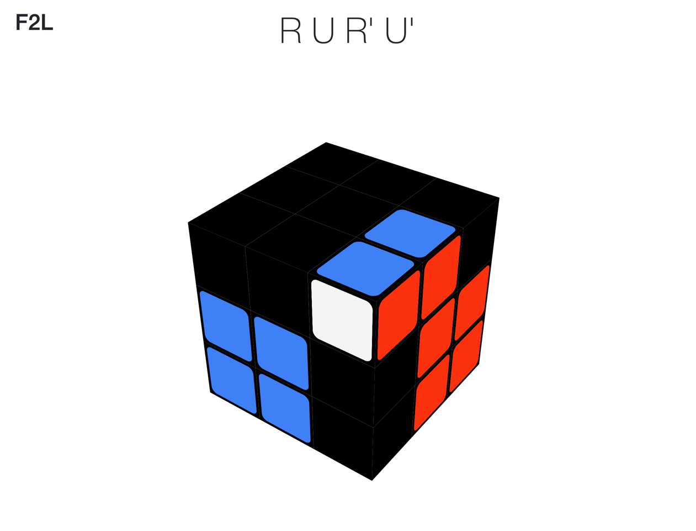
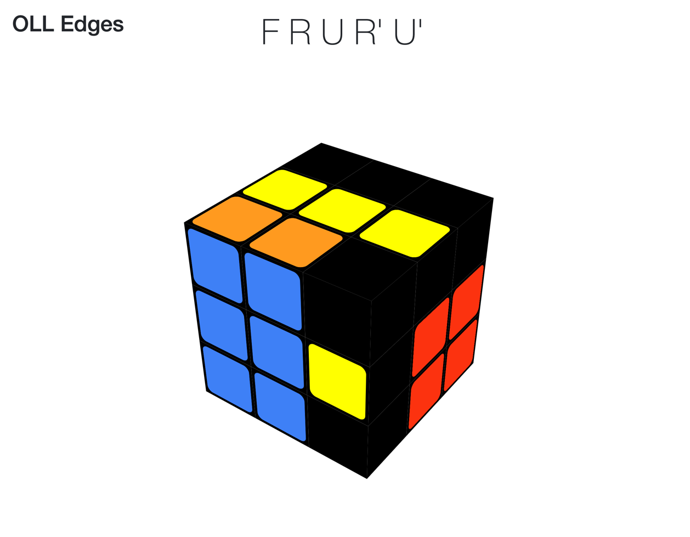

Cuber+
==============================================================================

Cuber+ is a modified version of [Cuber](https://github.com/tstaylor7/cuber), which is interactive 3D Rubik's cube simulator written in javascript.
Cuber+ implements some useful functions for instructing the CFOP method to learners in very beginning stage. 

## Getting started

Cloning the project and then open [./examples/basic/simple.html](./examples/basic/simple.html) file.

## How to use

### Display mode

You can change a display mode for each CFOP step by pressing [0-9] keys.

- 0: Standard mode
- 1: Cross mode
- 2: F2L mode
- 3: Edge OLL mode
- 4: OLL mode
- 5: Corner PLL mode
- 6: Edge PLL mode
- 7: PLL mode (same as standard mode)
- 8: Yellow Cross mode (Edge OLL mode with side stickers)
- 9: Last Layer mode (only show a top layer cubelets and center cubelets) 

### Rotation shortcuts

NOTION: For ease of input on a keyboard, the notation typically used in algorithms has been altered. 
However, the moving history displayed in the monitor is presented with a standard notation.

Note that uppercases and lowercases is altered to simplify the keyboard input. 

- u, d, r, l, f, b: rotate clockwise a specified face.
- U, D, R, L, F, B: rotate counter-clockwise a specified face.
- g, h, c, a, i, j: rotate clockwise specified two faces (each corresponds to u, d, r, l, f, b, respectively).
- G, H, C, A, I, J: rotate counter-clockwise specified two faces (each corresponds to u', d', r', l', f', b', respectively).
- m, s, e: slice middle layer clockwise
- M, S, E:  slice middle layer counter-clockwise
- \- (minus key) : undo rotation
- = (equal key) : redo rotation
- " " (space key): erase displayed history
- v: toggle history display mode
- p: toggle lefty mode (change viewpoint without y rotation)
- ?: shuffle with random 25 moves.

table of `input -> standard notation`

        l -> L
        r -> R
        u -> U
        d -> D
        f -> F
        b -> B
        L -> L'
        R -> R'
        U -> U'
        D -> D'
        F -> F'
        B -> B'
        a -> l
        c -> r
        g -> u
        h -> d
        i -> f
        j -> b
        A -> l'
        C -> r'
        G -> u'
        H -> d'
        I -> f'
        J -> b'
        M -> M'
        S -> S'
        E -> E'
        m -> M
        s -> S
        e -> E
        x -> x
        y -> y
        z -> z
        X -> x'
        Y -> y'
        Z -> z'
